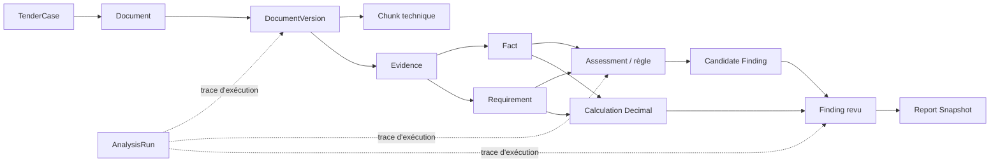

# SMART_AO V8 — Charte de reconstruction, de collaboration et de qualité

**Version :** 1.1 — charte renforcée à valider  
**Auteur :** Manus AI, avec validation métier du fondateur  
**Date :** 11 août 2026  
**Périmètre :** transformation sélective de SMART_AO V7.1 en SMART_AO V8  
**Baseline audité :** dépôt `mailtkarim-bot/SMART_AO_V7.1`, commit `56a08d97c0db2911c11c56b41e0aac53f9ded0e9`  
**Statut de la preuve :** audit statique en lecture seule ; aucune exécution du code, aucun test applicatif, aucun conteneur et aucun déploiement client n’ont été utilisés comme preuve dans cette charte.

---

## 0. Objet de la charte

Cette charte est le **contrat de travail de référence** pour la reconstruction de SMART_AO V8. Elle sert simultanément de garde-fou technique, de méthode de collaboration, de protocole de reprise inter-session et de critères de qualité avant toute exposition à un client.

Elle ne prétend pas qu’un logiciel complexe peut être rendu « sans faute » par une promesse. En informatique, cette garantie absolue n’existe pas. La promesse réaliste et mesurable est différente : **aucune capacité ne sera déclarée fiable, vendable ou prête pour un client sans preuves de conception, tests, revue métier et validation opérationnelle correspondant au risque.**

> **Règle directrice : nous ne croyons ni un document, ni une démo, ni un test isolé. Nous croyons une capacité lorsque sa spécification, son code, ses tests, son exécution reproductible et sa revue métier racontent la même histoire.**

La charte doit être relue au début de chaque session de travail. Toute décision qui la contredit nécessite soit un amendement formel, soit un ADR (Architecture Decision Record) si elle est coûteuse, difficilement réversible ou susceptible de modifier les garanties du produit.

---

## 1. Décision fondatrice : V8 est une reconstruction sélective

### 1.1 Décision

SMART_AO V7.1 devient le **legacy de référence**. Il doit être gelé, conservé et étudié. Il ne doit pas être utilisé comme fondation pour de nouvelles modifications structurelles. SMART_AO V8 sera créé dans un dépôt privé séparé, avec un historique propre, des contrats explicites et un produit pilote limité.

Cette décision ne signifie pas que V7.1 est inutile. Elle contient du capital important : vocabulaire BTP, idées produit, taxonomies, règles spécialisées, solveurs, tests de bord, scripts et retours d’architecture. Le principe est de **préserver le savoir, pas de copier la dette**.

| Élément V7.1 | Décision V8 | Raison |
|---|---|---|
| Règles BTP, nomenclature, cas d’acceptation | **EXTRAIRE puis valider** | Elles représentent du capital métier, mais ne sont pas automatiquement correctes parce qu’elles existent dans le code. |
| Types `Decimal`, `Amount`, solveurs mathématiques utiles | **CONSERVER les principes, extraire sélectivement** | Les calculs déterministes sont un actif ; les conventions, doublons et formules nécessitent une revue. |
| `Mission` et `mission.context` | **NE PAS MIGRER** | Le contexte mutable mélange état d’exécution, connaissances, sorties d’agents et résultats de rapport. |
| Workflow V7.1 | **REMPLACER** | L’orchestration inspectée mélange étapes, simulations, persistence et notifications. |
| EventBus V7.1 | **ADAPTER éventuellement comme transport local ; ne pas prendre comme source de vérité** | Historique mémoire borné, compatibilité legacy et absence de garanties transactionnelles démontrées. |
| Parser/chunking/RAG V7.1 | **RÉÉVALUER par contrat** | Des implémentations existent, mais la provenance, la structure et les garanties de retrieval sont insuffisantes pour une conclusion défendable. |
| Agents V7.1 | **RECLASSIFIER** | La majorité des composants inspectés sont des règles, services ou heuristiques ; ils ne doivent pas être présentés comme un parc d’agents cognitifs sans preuve. |

### 1.2 Ce que nous refusons de faire

Nous ne ferons pas un « V8 » qui consiste à renommer les dossiers V7.1, à déplacer `mission.context` dans une colonne JSON ou à brancher davantage d’agents sur le même state bag. Nous ne construirons pas non plus une plateforme distribuée, neuf microservices, un broker, un event store, un RAG hybride complexe et une flotte d’agents avant d’avoir démontré une valeur métier élémentaire.

La question qui dirige V8 n’est pas :

> « Comment reconstruire tous les engines ? »

La question est :

> « Comment produire, sur un DCE réel et anonymisé, une conclusion utile, calculable, relisible et remontable jusqu’à sa source ? »

---

## 2. Réalité vérifiée de V7.1 et limites de l’audit

### 2.1 Méthode de preuve

Les conclusions de cette charte se fondent sur un clone local au commit indiqué en tête du document, lu en lecture seule. Les fichiers de workflow, persistence, modèle Mission, bus d’événements, parser/chunking, RAG, types mathématiques, solveur de pénalités, registre et plusieurs agents ont été inspectés. Aucun code du dépôt n’a été exécuté pendant cet audit.

| Niveau de preuve | Définition opérationnelle |
|---|---|
| **OBSERVED** | Comportement lisible directement dans un fichier du commit de référence. |
| **SPECIFIED** | Décision V8 écrite et validée, mais non implémentée. |
| **IMPLEMENTED** | Code V8 écrit et relié à la capacité prévue. |
| **VERIFIED** | Code implémenté, testé dans un environnement reproductible et relié à une preuve de test/revue. |
| **REJECTED** | Hypothèse évaluée puis explicitement abandonnée. |

Aucune phrase de cette charte ne doit utiliser « production-ready », « conforme », « fiable » ou « validé » sans préciser l’artefact de preuve associé.

### 2.2 Constat majeur sur V7.1

Le modèle dominant observé dans V7.1 est proche de :

```text
WorkflowEngine
    ↓
Mission + mission.context
    ↓
steps / agents / calculs / rapport
    ↓
persistences partielles + EventBus mémoire
```

Ce modèle rend difficile la séparation entre :

- une donnée source ;
- une donnée extraite ;
- un fait validé ;
- un résultat de calcul ;
- une proposition d’agent ;
- une conclusion publiable ;
- une trace d’exécution.

Les constats suivants ont été vérifiés statiquement et doivent guider la reconstruction.

| Zone | Constat observé | Conséquence V8 |
|---|---|---|
| Mission | La Mission Pydantic porte documents, workflow, index d’étape et un `context: Dict[str, Any]`. | `AnalysisRun` devient une exécution ; les données métier deviennent des objets typés distincts. |
| Persistence Mission | `MissionRecord` porte `context`, mais sa conversion vers le modèle SQLAlchemy ne le persiste pas ; au rechargement, le contexte est reconstruit vide. | Ne jamais recréer un contexte métier global ; tout état canonique doit avoir son propre modèle et son round-trip testé. |
| Persistence Event | `save_event()` construit un `MissionEvent` avec des champs absents du modèle SQLAlchemy lu. | Le contrat d’événement V7.1 ne doit pas être migré ; V8 définit une enveloppe unique si une outbox devient nécessaire. |
| Workflow | Plusieurs étapes observées sont explicitement simulées et écrivent des flags dans le contexte. | Les flags ne sont pas migrables ; les moteurs V8 produisent des artefacts réels et typés. |
| Event Bus | L’historique est en RAM, borné à 10 000 événements ; le replay filtre cette mémoire. | Le bus n’est jamais une source de vérité ; la reprise durable exige une persistence adaptée lorsque l’asynchronisme existe. |
| Legacy event | Le module contient un wrapper `LegacyEvent` et un alias de compatibilité. | Aucun alias legacy ne traverse la frontière V8. |
| Retrieval | Le chemin RAG inspecté peut accepter un embedding nul et un sparse vide. | Un score de retrieval n’est pas une evidence ; index et provenance doivent être redéfinis. |
| Agents | Aucun appel direct de modèle n’a été trouvé dans les fichiers `agent_*.py` inspectés. | Les composants sont classés par comportement, non par nom « Agent ». |
| Math | Des types Decimal et solveurs spécialisés existent, mais certains résultats portent des dictionnaires génériques et les politiques numériques ne sont pas toutes explicites. | Le Math Engine est extrait, typé et soumis à une validation métier/juridique par formule. |

### 2.3 Limites à respecter

L’audit statique n’établit pas que tous les chemins V7.1 sont cassés ni que toutes les promesses documentaires sont fausses. Il établit seulement ce qui a été lu. Une absence de preuve n’est pas une preuve universelle d’absence.

Inversement, un test vert ou un commentaire « production ready » n’est pas une preuve suffisante de comportement métier. Les tests devront être exécutés plus tard dans un environnement reproductible, puis classés selon leur profondeur : import, unitaire, contrat, intégration, Golden DCE, panne/récupération.

---

## 3. Proposition de valeur produit V8

### 3.1 Client pilote

Le client initial cible est une entreprise française du BTP qui répond régulièrement à des appels d’offres et qui subit la dispersion des pièces DCE, des exigences, des délais, des clauses, des chiffres et de la mémoire technique. Le logiciel ne doit pas promettre de « gagner automatiquement un marché ». Il doit réduire le risque d’oublier une exigence, améliorer la traçabilité de la réponse et accélérer la décision de réponse.

### 3.2 Promesse V8 initiale

> **À partir d’un DCE, SMART_AO produit une analyse traçable des exigences, délais et pénalités : chaque résultat est relisible, lié à ses sources et clairement distingué entre donnée, calcul et recommandation.**

Cette promesse est plus forte et plus crédible qu’un discours sur des dizaines d’agents. Elle permet au client de comprendre ce que le produit a trouvé, où il l’a trouvé, comment une règle a été appliquée et ce qui reste à valider humainement.

### 3.3 Premier vertical slice obligatoire

Le premier parcours V8 est volontairement étroit :

```text
DCE Golden anonymisé
    ↓
Document versionné et hashé
    ↓
Parsing contrôlé
    ↓
Evidence localisables
    ↓
Fact / Requirement sourcés
    ↓
Règle déterministe de délais ou de pénalités
    ↓
Calculation Decimal traçable
    ↓
Finding soumis à revue
    ↓
Report snapshot navigable vers les sources
```

Le premier pilote ne comprend pas, sauf besoin prouvé : veille nationale, RAG hybride avancé, génération de mémoire technique, entraînement de modèles, vingt agents, multi-client complet, VPS client, chatbot autonome, n8n ou broker distribué.

### 3.4 Non-objectifs initiaux

| Élément | Statut avant le vertical slice | Raisonnement |
|---|---|---|
| Réponse automatique à un marché | Hors périmètre | La responsabilité métier et juridique exige une revue humaine. |
| Calcul de prix autonome par IA | Interdit | Le calcul relève du Math Engine déterministe et de la validation humaine. |
| LLM qui publie directement un finding | Interdit | Une sortie LLM est toujours un candidat. |
| Déploiement chez un client | Interdit avant G7 | Aucun client ne doit servir de banc d’essai. |
| Fleet management de VPS | Différé | C’est une capacité d’exploitation, pas le noyau métier initial. |
| Agent multi-outils autonome | Différé | À évaluer après preuve de valeur du produit de base. |

---

## 4. Principes non négociables V8

### 4.1 Séparation des vérités

Les égalités suivantes sont interdites conceptuellement :

```text
EventBus            ≠ base métier
LLM output          ≠ vérité métier
Retrieval result    ≠ evidence validée
Evidence            ≠ fact
Fact                ≠ finding
Finding             ≠ calculation
Calculation         ≠ rapport
Execution state     ≠ état métier
```

Chaque flèche doit être une transformation explicite, gouvernée par un contrat et contrôlée par des invariants.

### 4.2 Provenance avant intelligence

Une conclusion utile au client doit pouvoir répondre aux questions suivantes :

1. Dans quelle pièce et quelle version cette information apparaît-elle ?
2. À quel emplacement exact peut-elle être relue ?
3. Par quelle méthode a-t-elle été extraite ou saisie ?
4. Quelle règle, formule ou politique a été utilisée ?
5. Quelle version du calcul, de la règle ou du modèle a produit le résultat ?
6. Qui ou quoi a validé le résultat ?
7. Quel est le niveau d’incertitude et quel contrôle humain reste attendu ?

Un finding ne peut pas être publié si sa chaîne de provenance est incomplète. Cette exigence est plus importante que la sophistication du modèle IA.

### 4.3 Calcul déterministe et frontière financière

Le Math Engine ne lit pas le DCE brut, n’appelle jamais de LLM, n’utilise jamais de `float` pour une valeur financière et ne reçoit pas un dictionnaire libre comme contrat interne. Il reçoit des données validées, typées, versionnées et accompagnées de règles d’arrondi explicites.

```text
Fact / Requirement validés
    ↓
CalculationRequest typée
    ↓
Math Engine sans LLM
    ↓
CalculationResult + trace
    ↓
Finding / Report
```

La règle « zéro euro dans un finding qualitatif » peut être conservée comme garde-fou secondaire, mais elle ne remplace ni les types, ni les permissions, ni la séparation de capabilities.

### 4.4 IA sous contrôle

Un composant n’est appelé **Cognitive Agent** que s’il consomme des entrées explicitement référencées, peut utiliser un modèle/génération ou un raisonnement non déterministe, déclare son incertitude, produit une sortie structurée, porte une trace d’exécution et respecte une politique de coût/confidentialité.

Les règles, détecteurs, calculateurs, retrievers et adaptateurs ne sont pas des agents cognitifs. La taxonomie V8 est :

| Classe | Rôle |
|---|---|
| `DOMAIN_RULE` | Applique une règle explicite, versionnée et testable. |
| `DOMAIN_SERVICE` | Porte une logique métier déterministe ne relevant pas d’une entité unique. |
| `CALCULATION_SERVICE` | Exécute un calcul déterministe avec types numériques. |
| `RETRIEVER` | Retrouve des passages/documentations ; ne crée pas de vérité métier. |
| `TOOL` | Fournit une capacité technique encapsulée. |
| `COGNITIVE_AGENT` | Produit des candidats structurés avec incertitude et traces. |
| `ORCHESTRATOR` | Organise des commandes et dépendances sans posséder les vérités métier. |
| `INFRASTRUCTURE` | Persistence, object storage, transport, observabilité. |

La sortie d’un LLM suit obligatoirement le parcours :

```text
LLM / outil cognitif
    ↓
CandidateEvidence ou CandidateFinding
    ↓
Validation de preuve et de règles
    ↓
Fact / Finding accepté
    ↓
Rapport
```

### 4.5 Pas de contexte mutable comme contrat métier

Aucun nouveau code V8 ne doit accepter, propager ou persister un équivalent de `mission.context: Dict[str, Any]` comme vérité métier. Les structures libres peuvent exister seulement aux frontières d’adaptation V7 ou de formats externes, puis elles sont normalisées immédiatement.

---

## 5. Modèle de domaine V8 minimal

### 5.1 Chaîne de connaissance cible



### 5.2 Objets nécessaires au pilote

| Objet | Rôle | Invariants initiaux |
|---|---|---|
| `TenderCase` | Dossier métier et isolation logique du client. | Appartient à un tenant ; ne porte pas le contenu de tous les documents. |
| `Document` | Identité logique d’une pièce. | Une pièce peut avoir plusieurs versions ; pas de contenu directement mutable. |
| `DocumentVersion` | Artefact ingéré, hashé, parserisé. | Immédiate après `READY` ; hash, parser et artefact ne changent plus. |
| `Chunk` | Unité technique de recherche/lecture. | Rattaché à une version ; n’est pas automatiquement une preuve. |
| `Evidence` | Extrait probant localisable. | Porte document version, locator, extrait ou valeur normalisée, méthode et hash source. |
| `Fact` | Information normalisée et sourcée. | Aucun fact important sans evidence ou origine explicitement déclarée. |
| `Requirement` | Obligation issue du DCE. | Séparée d’une évaluation de capacité de l’entreprise. |
| `RuleVersion` | Règle métier ou de calcul. | Une règle active est immuable ; une modification crée une nouvelle version. |
| `Calculation` | Exécution déterministe traçable. | Inputs typés, références de règles, version du solveur et résultat Decimal. |
| `Finding` | Conclusion métier structurée et revue. | Pas de finding accepté sans evidence, et calcul lorsqu’il est requis. |
| `AnalysisRun` | Trace d’une exécution. | Ne contient pas toute la vérité métier ; référence les artefacts et étapes. |
| `ReportSnapshot` | Vue publiable des artefacts acceptés. | Référence des versions exactes ; ne recalcule ni n’extrait. |

Les objets `AgentRun`, `AnalysisAttempt`, `CalculationRun`, `Assessment` persistant riche et `Event Inbox` sont introduits lorsque le produit pilote en démontre la nécessité : LLM, workers, retry, revue multi-utilisateur ou consommateurs asynchrones.

### 5.3 Invariants P0 du pilote

| ID | Invariant | Preuve attendue |
|---|---|---|
| `INV-P0-001` | Une `DocumentVersion` prête est immuable et hashée. | Test de mutation/refus après `READY`. |
| `INV-P0-002` | Une `Evidence` validée référence une version et une localisation existantes. | Test de locator, hash et version. |
| `INV-P0-003` | Un `Fact`/`Requirement` utilisable porte une provenance explicite. | Test de rejet sans evidence/origine. |
| `INV-P0-004` | Une `Calculation` utilise uniquement `Decimal`, une règle et des inputs versionnés. | Test de type, d’arrondi et de relecture. |
| `INV-P0-005` | Le Math Engine n’appelle jamais de LLM. | Test statique d’import et test de contrat. |
| `INV-P0-006` | Un finding accepté porte sa preuve, sa règle et son calcul si nécessaire. | Test de publication/refus. |
| `INV-P0-007` | Un rapport ne contient que des résultats persistés et acceptés. | Test de snapshot déterministe. |
| `INV-P0-008` | Une donnée financière ne franchit pas une frontière non autorisée. | Test RBAC/capability de sortie. |
| `INV-P0-009` | Un redémarrage/rechargement restitue le même état canonique. | Test `persist → reload → compare`. |

### 5.4 États minimaux

Les états V8 ne doivent exister que pour empêcher une transition incohérente.

| Objet | États du pilote |
|---|---|
| `AnalysisRun` | `CREATED`, `RUNNING`, `SUCCEEDED`, `FAILED`, `CANCELLED` |
| `DocumentVersion` | `PROCESSING`, `READY`, `FAILED`, `QUARANTINED` |
| `Evidence` | `VALID`, `RETRACTED` |
| `Fact` | `CANDIDATE`, `VERIFIED`, `CONFLICTING`, `REJECTED`, `SUPERSEDED` |
| `Requirement` | `DETECTED`, `VERIFIED`, `REJECTED`, `SUPERSEDED` |
| `RuleVersion` | `DRAFT`, `ACTIVE`, `RETIRED` |
| `Calculation` | `COMPLETED`, `FAILED`, `INVALIDATED` |
| `Finding` | `DRAFT`, `SUPPORTED`, `ACCEPTED`, `REJECTED`, `SUPERSEDED` |
| `ReportSnapshot` | `DRAFT`, `PUBLISHED`, `SUPERSEDED` |

Toute transition se fait par une commande ou une méthode de domaine explicite. Un simple `status = "accepted"` dans un contrôleur, un ORM ou une tâche est interdit.

---

## 6. Architecture cible minimale et contrats

### 6.1 Principe de monolithe modulaire

V8 commence comme un monolithe modulaire sur une PostgreSQL logique et un stockage d’objets. Il n’y a ni microservices ni base par engine. Les frontières sont d’abord logiques, testables par les imports autorisés et les contrats publics.

```text
API / CLI
    ↓ commandes typées
Application layer
    ↓
Domain modules
    ├── Document
    ├── Evidence / Knowledge
    ├── Rules / Assessment
    ├── Math
    ├── Report
    └── Analysis orchestration
    ↓ ports
Infrastructure
    ├── PostgreSQL
    ├── Object storage
    ├── parser/OCR
    ├── retrieval index
    ├── LLM provider éventuel
    └── observabilité
```

### 6.2 Contrats minimaux du pilote

Nous ne produisons pas neuf contrats exhaustifs avant le premier code. Nous écrivons les cinq contrats ci-dessous, chacun limité, versionné et testé.

| Contrat | Responsabilité | Interdits | Entrée / sortie minimale |
|---|---|---|---|
| **Document Contract** | Transformer une version de document en artefacts structurés et chunks techniques. | Créer un finding, calculer, appeler un agent. | `ProcessDocumentVersion → ParsedDocument + Chunk[]`. |
| **Evidence-Fact Contract** | Créer les preuves, faits et exigences sourcés. | Lire une base vectorielle comme vérité, produire un rapport, utiliser un LLM directement. | `EvidenceCandidate → Evidence`, `Evidence → Fact/Requirement`. |
| **Rule-Math Contract** | Appliquer une règle versionnée à des inputs validés. | Lire un PDF brut, utiliser un LLM, renvoyer un dictionnaire non typé. | `CalculationRequest → CalculationResult + trace`. |
| **Finding-Report Contract** | Composer une conclusion revue et une restitution versionnée. | Reparser, recalculer, modifier un fait, appeler un LLM. | `Finding/Calculation refs → ReportSnapshot`. |
| **Thin Orchestrator Contract** | Démarrer, corréler et suivre l’exécution du vertical slice. | Porter le contenu métier, dépendre des classes concrètes, écrire un contexte global. | `Create/Start AnalysisRun → références d’étapes et statuts`. |

### 6.3 Règles de dépendances

Un module n’appelle directement que le **port public** d’un autre module. Les imports de modèles ORM, clients d’infrastructure ou classes d’agents depuis des composants métier sont interdits hors adapters dédiés.

| Depuis | Peut dépendre de | Ne dépend jamais directement de |
|---|---|---|
| Orchestrateur | Ports Document, Evidence, Rule-Math, Report | Parser concret, classe agent, ORM, LLM, contexte global |
| Document | Object storage, port parser, port chunker | Finding, Math, Report, agent cognitif |
| Retrieval | Chunks/index/metadata | Fact validé, Finding, Math, Report |
| Evidence-Fact | Versions de documents, ports de retrieval | Provider LLM concret, Report, contexte global |
| Math | Types financiers, règles, références validées | LLM, parser, vector DB, agent |
| Report | Findings/calculations acceptés et templates | Parser, Math interne, agent, DCE brut |
| Agent cognitif futur | Ports de retrieval/outils autorisés | ORM, EventBus interne, autre agent concret, Math interne |

### 6.4 Événements et cohérence

Les événements ne seront introduits que pour un besoin asynchrone ou de propagation clairement identifié. Le pilote peut être majoritairement synchrone. Lorsqu’un worker ou un effet de bord externe est ajouté, la politique devient :

```text
Commande
    ↓
transaction PostgreSQL
    ├── mutation d’agrégat
    └── insertion OutboxEvent
    ↓ COMMIT
Dispatcher
    ↓
consumer idempotent
    ↓
ACK / retry / DLQ
```

Les garanties honnêtes sont : **at-least-once delivery** et **consommation idempotente**. Nous ne promettons jamais un « exactly once » global, notamment pour un appel LLM ou la génération d’un fichier externe.

| Situation | Garantie attendue lorsque l’outbox est activée |
|---|---|
| Échec avant commit | Aucune mutation ni outbox persistée. |
| Commit réussi, dispatcher arrêté | Mutation persistée et outbox en attente ; livraison reprise. |
| Livraison doublée | Consumer idempotent : pas de double effet métier. |
| Échec transitoire du consumer | Retry avec backoff et observabilité. |
| Échec permanent | DLQ durable et procédure de reprise. |
| Génération de fichier externe | Clé de génération, hash d’artefact et réconciliation des fichiers orphelins. |

L’outbox/inbox ne doit pas être codée avant qu’un consommateur asynchrone réel existe. En revanche, ses hypothèses — idempotency key, événements versionnés, absence de source de vérité dans le bus — doivent être intégrées dès les contrats.

---

## 7. Sécurité, confidentialité, données et responsabilité

### 7.1 Données DCE et confidentialité

Les DCE peuvent contenir des données sensibles, commerciales ou confidentielles. Les documents réels ne sont jamais commités dans Git. Les fixtures sont anonymisées, synthétiques ou remplacées par des hashes et métadonnées selon le besoin du test.

| Règle | Décision |
|---|---|
| Git | Aucun DCE client, secret, export client ou token ne rejoint le dépôt. |
| Object storage | Les artefacts sont identifiés, hashés, chiffrés selon l’environnement et liés à un tenant. |
| Logs | Aucun texte brut non nécessaire, prix, token, DCE complet ou PII ne doit être journalisé par défaut. |
| Fixtures | Corpus Golden anonymisé, versionné, avec droits d’utilisation établis. |
| Export | Un rapport est un snapshot ; sa rétention et sa suppression suivent une politique explicite. |

### 7.2 IA et fournisseurs de modèles

Le client Ollama observé dans V7.1 peut viser une URL configurable. Un indicateur déclaratif « local » ne prouve pas que l’hôte cible est local. V8 n’envoie donc jamais un contenu confidentiel à un modèle ou fournisseur sans politique réellement appliquée.

Avant qu’un LLM soit activé, il faut une décision explicite documentant : type de données autorisé, provider, localisation, contrôle des hôtes, journal d’invocation, politique de fallback, budget, conservation et capacité de désactivation.

```text
Document / Evidence classifié
    ↓
Policy check
    ├── interdit → pas de modèle
    ├── local autorisé → provider local allowlisté
    └── externe autorisé → provider explicitement approuvé
```

### 7.3 Règles métier, droit et responsabilité

Les règles BTP, de commande publique, financières, contractuelles ou de sécurité sont des **règles à valider**, non des vérités parce qu’elles existent dans V7.1 ou dans un prompt. Le logiciel doit présenter des alertes sourcées et des analyses ; il ne doit pas se présenter comme avis juridique définitif, validation comptable ou décision de soumission automatique.

Chaque règle P0 doit porter : identifiant, version, propriétaire métier, sources, portée, exceptions, date d’effet, état de validation et tests d’acceptation. Toute modification de règle crée une nouvelle version et ne réécrit pas l’historique.

### 7.4 Multi-tenant et VPS

La séparation « un VPS par client » peut être pertinente pour l’isolation et le discours de souveraineté, mais elle ne sera pas le premier problème à résoudre. Avant un premier déploiement client, le produit doit disposer d’une isolation documentée, de sauvegardes, d’une restauration testée, d’une politique de secrets, d’un monitoring minimum et d’une procédure d’incident.

Le premier environnement serveur sert de **préproduction contrôlée**, pas de production déguisée. Un client ne sera jamais le testeur final d’un parcours non validé.

---

## 8. Méthode de collaboration entre le fondateur et l’assistant

### 8.1 Répartition des responsabilités

| Sujet | Fondateur | Assistant |
|---|---|---|
| Vision produit, client cible, valeur commerciale | Décision finale | Prépare analyses, options et formulations. |
| Règles BTP, finance, droit, sécurité chantier | Valide ou mandate l’expert compétent | Formalise, trace, teste, signale l’incertitude. |
| Architecture et plan d’implémentation | Valide les décisions structurantes | Propose, documente, implémente par périmètre contrôlé. |
| Code et tests | Accepte les changements par revue | Écrit, teste, documente et prépare une PR. |
| Secrets, accès, coûts, fournisseurs | Garde le contrôle | N’utilise que les accès nécessaires et signale les prérequis. |
| Déploiement et mise en production | Autorise chaque gate | Prépare, vérifie et exécute dans la limite des autorisations reçues. |
| Décision de vente / promesse client | Décision finale | Fournit la preuve de qualité et les limites documentées. |

Le fondateur n’a pas besoin de coder quotidiennement. Il doit toutefois valider les critères métier, les DCE de référence, les règles à impact financier/juridique et les gates de production.

### 8.2 Protocole de début de session

Avant tout changement, la session suit cet ordre :

1. Lire `V8_PRODUCT_CONTRACT.md` ;
2. Lire la présente charte ;
3. Lire `V8_IMPLEMENTATION_STATUS.md` et le dernier `SESSION_HANDOFF.md` ;
4. Lire le work item courant et ses critères d’acceptation ;
5. Lire uniquement les contrats et fichiers nécessaires au périmètre ;
6. Vérifier la branche, le commit de base et l’état Git ;
7. Énoncer l’objectif limité, les risques et les preuves attendues ;
8. N’écrire le code qu’après cette vérification.

Aucune session ne doit repartir de l’historique implicite du chat. Le dépôt versionné est la mémoire institutionnelle.

### 8.3 Protocole de clôture de session

Toute session qui modifie ou analyse un périmètre doit terminer par un handoff concis :

```markdown
# SESSION_HANDOFF

- Date et branche :
- Objectif du work item :
- État : non commencé / en cours / bloqué / prêt à revoir / fusionné
- Décisions prises :
- Fichiers modifiés :
- Contrats impactés :
- Tests exécutés et résultats :
- Tests non exécutés et raison :
- Risques connus :
- Prochaine action unique :
- Validation attendue du fondateur :
```

Le handoff ne remplace pas les tests ni le statut d’implémentation. Il rend simplement la reprise immédiate possible.

### 8.4 Work item obligatoire

Aucun changement non trivial ne commence sans work item. Un work item doit être petit, vérifiable et limité à un périmètre.

| Champ | Contenu attendu |
|---|---|
| ID | `V8-WP-xxx` ou `V8-FEAT-xxx` |
| Problème métier | Formulé en langage utilisateur. |
| Décision / contrat impacté | Référence de document et invariant. |
| Hors périmètre | Ce qui ne doit pas changer. |
| Risques | Données, calculs, sécurité, compatibilité, concurrence. |
| Critères d’acceptation | Observables et testables. |
| Tests attendus | Unitaire, contrat, intégration, Golden DCE, panne. |
| Evidence de sortie | Logs, rapport, captures, hashes, résultats de tests. |
| Rollback | Méthode d’annulation ou de désactivation. |

### 8.5 Git et revue

La branche `main`/`master` V8 est protégée. Aucun changement direct ne doit y être poussé. Chaque évolution passe par une branche dédiée et une pull request ou une revue équivalente.

```text
main
  └── v8/wp-001-product-contract
  └── v8/wp-010-document-ingestion
  └── v8/fix-penalty-rounding
```

Une PR doit inclure : objectif, lien du work item, décisions/ADR, périmètre, tests exécutés, tests non exécutés, migration de données éventuelle, impact sécurité, rollback et captures/artefacts si pertinent.

Un gros changement incompréhensible n’est pas un gain de vitesse ; c’est une dette de revue.

---

## 9. Documentation V8 : mémoire durable, minimale et autoritaire

### 9.1 Source of Truth

V8 débute avec peu de documents, mais chacun a un rôle clair.

| Document | Autorité | Mise à jour obligatoire lorsque… |
|---|---|---|
| `V8_PRODUCT_CONTRACT.md` | Valeur client et périmètre pilote. | Le client cible, le flux, les non-objectifs ou la réussite changent. |
| `V8_DOMAIN_MODEL.md` | Objets métier, relations, invariants et versioning. | Une entité, relation ou invariant évolue. |
| `V8_GOLDEN_DCE_CATALOG.md` | Corpus de référence et résultats attendus. | Un cas est ajouté/modifié ou un résultat validé change. |
| `V8_MASTER_REBUILD_PLAN.md` | Roadmap, migration, gates et priorités. | Une gate est franchie ou une priorité change. |
| `V8_IMPLEMENTATION_STATUS.md` | Réalité du code et des preuves. | Une capacité passe de SPECIFIED à IMPLEMENTED ou VERIFIED. |
| `SESSION_HANDOFF.md` | Reprise opérationnelle de la dernière session. | À chaque fin de session substantielle. |
| `ADR/ADR-xxx.md` | Décision coûteuse/irréversible. | Une décision ne peut plus être simplement exprimée dans un work item. |

### 9.2 Statut d’implémentation

Chaque capacité est décrite par une ligne de preuve :

| Capability | Status | Code | Tests | Evidence | Owner | Dernière revue |
|---|---|---|---|---|---|---|
| Ingestion PDF Golden DCE | `SPECIFIED` | — | — | — | Document | — |
| Evidence localisable | `SPECIFIED` | — | — | — | Evidence | — |
| Calcul de pénalités V8 | `SPECIFIED` | — | — | — | Math | — |
| Rapport source-linked | `SPECIFIED` | — | — | — | Report | — |

Le mot **VERIFIED** n’est autorisé que si la ligne pointe vers des tests exécutés et un résultat consultable.

### 9.3 Documentation à ne pas créer prématurément

Nous ne créons pas, avant le premier slice, une encyclopédie d’engine contracts, une carte exhaustive de trente agents, un catalogue d’événements complet ou un journal de décisions quotidien. Ces documents sont utiles lorsqu’un besoin réel apparaît. Avant cela, ils deviennent un substitut de code et de preuves.

---

## 10. Stratégie de tests et de preuve

### 10.1 Pyramide de preuve

| Niveau | Question posée | Exemple |
|---|---|---|
| L0 — Static | Les dépendances et types interdits sont-ils absents ? | Math sans LLM, pas de secret dans Git, imports autorisés. |
| L1 — Unit | La règle ou l’objet respecte-t-il ses invariants ? | Arrondi de pénalité, transition de Finding. |
| L2 — Contract | La sortie d’un module est-elle compatible avec l’entrée du suivant ? | Parser → Evidence, Fact → CalculationRequest. |
| L3 — Integration | Le parcours produit fonctionne-t-il avec les vrais adapters ? | PDF → chunks → evidence → finding → report. |
| L4 — Golden DCE | Le résultat métier est-il conforme à une attente validée ? | Clause de pénalité identifiée, citée et calculée. |
| L5 — Failure | Le système résiste-t-il au timeout, crash et redémarrage pertinent ? | Rechargement de DocumentVersion, idempotence de rapport. |
| L6 — Préproduction | Les opérations réelles sont-elles réversibles et observables ? | Backup/restore, monitoring, release checklist. |

Un test d’import, une assertion de structure ou un mock peut être utile, mais ne doit jamais être présenté comme preuve du flux métier réel.

### 10.2 Golden DCE

Le Golden DCE est la référence de qualité. Il doit être anonymisé, versionné et accompagné d’attentes métier explicites.

| Élément | Contenu obligatoire |
|---|---|
| Identifiant | `DCE-GOLD-001` |
| Droits | Origine et droit d’usage/anonymisation établis. |
| Pièces | Liste, hashes, versions et format. |
| Scénario | Ce que l’utilisateur demande au logiciel. |
| Truth set | Clauses, pages, dates, montants ou exigences attendus. |
| Règles | Version de règle applicable. |
| Résultats attendus | Finding, calcul, alertes et incertitudes prévues. |
| Validation | Personne responsable de l’acceptation métier. |
| Régression | Politique lorsque le résultat change. |

Le même DCE rejoué avec les mêmes versions de règles, parser et données doit produire le même résultat déterministe, ou expliquer explicitement l’écart contrôlé.

### 10.3 Tests de panne à différer intelligemment

Les tests outbox/inbox/DLQ sont nécessaires avant qu’un worker, un webhook, une file ou un fournisseur externe rende l’exécution asynchrone critique. Ils ne bloquent pas un vertical slice entièrement synchrone, mais ils deviennent obligatoires dès que l’architecture les introduit.

Les tests fondamentaux d’un tel mécanisme seront alors : rollback avant commit, outbox persistée après commit, redelivery, consommateur idempotent, conflit optimiste, retry classé et DLQ durable.

---

## 11. Feuille de route de reconstruction

### Gate G0 — Geler le legacy

**Objectif :** disposer d’une base V7.1 stable et consultable sans la confondre avec V8.

**Preuves requises :** tag Git du commit de référence, branche principale protégée, inventaire des décisions d’audit, aucune modification structurelle non validée sur V7.1.

### Gate G1 — Contrat produit pilote

**Objectif :** définir précisément ce que le premier utilisateur obtient.

**Preuves requises :** `V8_PRODUCT_CONTRACT.md` validé par le fondateur ; persona, problème, flux, non-objectifs, métriques de succès et limites de responsabilité.

### Gate G2 — Golden DCE

**Objectif :** mesurer la valeur sur un corpus réel et autorisé.

**Preuves requises :** `DCE-GOLD-001`, anonymisation/droits, truth set, critères d’acceptation et relecteur métier désigné.

### Gate G3 — Noyau de domaine et contrats

**Objectif :** rendre impossible la confusion entre source, preuve, fait, calcul et rapport.

**Preuves requises :** quatre documents fondamentaux V8, invariants P0, commandes du pilote et tests de contrat rédigés avant le code.

### Gate G4 — Vertical slice fonctionnel

**Objectif :** exécuter le parcours complet sur le Golden DCE.

**Preuves requises :** document hashé, evidences localisables, fait/exigence sourcé, calcul Decimal, finding revu, rapport navigable et test d’intégration reproductible.

### Gate G5 — Fiabilité des calculs

**Objectif :** confirmer les résultats financiers et contractuels critiques.

**Preuves requises :** matrice de règles, versions, cas limites, politique d’arrondi, validation métier/juridique et tests de régression.

### Gate G6 — IA optionnelle

**Objectif :** prouver qu’une capacité cognitive apporte plus de valeur qu’une baseline déterministe.

**Preuves requises :** trace d’invocation, politique de confidentialité, budget, output structuré, revue humaine, comparaison qualité/coût et plan de fallback.

### Gate G7 — Préproduction

**Objectif :** préparer une mise à disposition non risquée.

**Preuves requises :** CI reproductible, secret management, monitoring, sauvegarde/restauration testée, isolation, procédure d’incident, checklist de release et environnement de préproduction distinct.

### Gate G8 — Premier client

**Objectif :** ouvrir l’accès au premier client seulement après preuves, pas après intuition.

**Preuves requises :** validation explicite du fondateur, résultats préproduction, limites contractuelles visibles, plan de support, rollback, sauvegarde et observabilité opérationnelle.

---

## 12. Roadmap de travail immédiate

| Ordre | Work package | Résultat livrable | Condition de sortie |
|---:|---|---|---|
| 1 | `V8-WP-001` — Legacy freeze | Tag, branche protégée, références du commit V7.1. | V7.1 est consultable et ne reçoit plus de refonte structurelle. |
| 2 | `V8-WP-002` — Product Contract | Contrat produit de 2–4 pages. | Le fondateur valide le problème pilote et les non-objectifs. |
| 3 | `V8-WP-003` — Golden DCE | Catalogue `DCE-GOLD-001`, truth set, droit d’usage. | La qualité peut être mesurée. |
| 4 | `V8-WP-004` — Domain core | Domain model et invariants P0 du pilote. | Les objets et relations sont validés. |
| 5 | `V8-WP-005` — Document/Evidence contract | Contrats de parsing, locator et provenance. | Chaque evidence est localisable. |
| 6 | `V8-WP-006` — Rule/Math contract | CalculationRequest/Result et règle de pénalité. | Calcul Decimal reproductible et revu. |
| 7 | `V8-WP-007` — Finding/Report contract | Finding sourcé et rapport snapshot. | Le rapport n’invente ni ne recalcule. |
| 8 | `V8-WP-008` — Vertical slice | Implémentation, migrations limitées, tests. | DCE-GOLD-001 passe de bout en bout. |
| 9 | `V8-WP-009` — Durcissement | CI, logs, reprise, failure tests pertinents. | Préproduction possible. |

### Critère de discipline

Un work package ne peut pas être déclaré terminé avec « le code est écrit ». Il est terminé seulement lorsque ses critères d’acceptation, ses tests, sa documentation et son statut `VERIFIED` sont réunis.

---

## 13. Qualité de code et règles d’implémentation

1. **Une capacité = un périmètre.** Un PR ne mélange pas migration, UI, calcul, sécurité et refonte générale.
2. **Types aux frontières.** Tout payload externe est validé et normalisé à l’entrée.
3. **Pas de dictionnaire comme domaine.** Les dictionnaires restent dans les adapters et les formats externes.
4. **Pas d’ORM dans le domaine.** L’ORM applique persistence, clés, contraintes et index ; le domaine protège les transitions et invariants.
5. **Pas de logique métier dans un contrôleur API.** L’API émet une commande vers la couche application.
6. **Une seule source pour une formule.** Aucun solveur dupliqué n’est conservé sans tests de comparaison et décision de fusion.
7. **Nommage explicite.** `CandidateFinding`, `Finding`, `Calculation`, `ReportSnapshot` ne sont pas interchangeables.
8. **Échecs explicites.** Une erreur de persistence, invariant ou autorisation remonte une erreur typée ; elle n’est pas convertie silencieusement en `False` suivi d’une continuation.
9. **Logs structurés.** Les traces comportent correlation ID, entité, commande, statut et durée, sans exposer par défaut les données sensibles.
10. **Secrets hors code.** Aucun token, URL sensible ou secret ne réside dans Git ; la configuration est validée au démarrage.

---

## 14. Gestion des risques

| Risque | Niveau initial | Prévention | Preuve de réduction |
|---|---:|---|---|
| Conclusion sans source fiable | Critique | Evidence localisable, provenance closure, revue humaine. | Golden DCE + liens sources. |
| Erreur de calcul BTP | Critique | Decimal, règle versionnée, cas limites, validation experte. | Tests et approbation de règle. |
| Histoire/documentation qui diverge du code | Élevé | SSoT, statut OBSERVED/SPECIFIED/IMPLEMENTED/VERIFIED. | Implementation status mis à jour à chaque PR. |
| Perte d’état au redémarrage | Élevé | Round-trip tests, persistence typée, absence de contexte global. | Test `persist → reload`. |
| Double traitement asynchrone | Élevé si worker | Idempotency keys, inbox/outbox, artefact hash. | Tests de redelivery. |
| Fuite de DCE vers un provider modèle | Critique | Policy engine, allowlist, logs, séparation local/externe. | Test de configuration et audit de route. |
| Trop grande portée V8 | Critique | Golden DCE, non-objectifs, gates, work items limités. | Revue de scope avant chaque package. |
| Déploiement client prématuré | Critique | G7/G8 et préproduction distincte. | Checklist de release et validation fondateur. |

---

## 15. Changement de la charte

La charte est stable, mais non immuable. Elle doit évoluer si le produit pilote, la contrainte réglementaire, la politique de confidentialité, le modèle d’hébergement ou la preuve apportée par les tests change.

Une modification nécessite : le motif, les alternatives considérées, les modules impactés, les migrations, les risques, les tests à ajouter et le propriétaire de validation. Une décision irréversible ou coûteuse devient un ADR.

Les changements non documentés sont interdits lorsqu’ils affectent : modèle de données, calcul, sécurité, confidentiality routing, multi-tenant, événements, rétention, publication de rapport ou déploiement client.

---

## 16. Déclaration de travail commune

Nous travaillons désormais selon les règles suivantes :

> **Nous allons lentement sur les contrats, rapidement sur les preuves, et jamais vite sur les promesses client.**

> **Chaque capacité V8 sera construite par périmètre, sur une branche, avec un work item, une spécification, une preuve et une décision de fusion.**

> **Le client ne voit pas une démonstration d’IA : il voit une analyse métier expliquée, sourcée, calculable et contrôlable.**

> **La mémoire de notre collaboration ne dépend pas d’une conversation. Elle vit dans le dépôt, les contrats, les tests, les handoffs et les décisions versionnées.**

Cette charte est la base sur laquelle seront produits les quatre documents initiaux V8, puis le premier vertical slice. Dès qu’elle est validée par le fondateur, la prochaine action est `V8-WP-002 — V8_PRODUCT_CONTRACT.md`, suivie de la sélection du `DCE-GOLD-001`.

---

## Références et registre de preuve

Les références suivantes servent à retrouver les sources de l’audit. Elles ne transforment pas un constat statique en preuve d’exécution ; la preuve d’exécution devra être ajoutée dans `V8_IMPLEMENTATION_STATUS.md` avec les résultats de tests correspondants.

[1]: https://github.com/mailtkarim-bot/SMART_AO_V7.1 "Dépôt SMART_AO V7.1"
[2]: https://github.com/mailtkarim-bot/SMART_AO_V7.1/blob/main/app/engines/workflow_engine/workflow.py "Workflow Engine V7.1"
[3]: https://github.com/mailtkarim-bot/SMART_AO_V7.1/blob/main/app/engines/workflow_engine/mission.py "Mission V7.1"
[4]: https://github.com/mailtkarim-bot/SMART_AO_V7.1/blob/main/app/engines/workflow_engine/persistence.py "Persistence Workflow V7.1"
[5]: https://github.com/mailtkarim-bot/SMART_AO_V7.1/blob/main/app/engines/event_bus/bus.py "Event Bus V7.1"
[6]: https://github.com/mailtkarim-bot/SMART_AO_V7.1/blob/main/app/engines/knowledge_engine/rag_hybrid.py "RAG hybride V7.1"
[7]: https://github.com/mailtkarim-bot/SMART_AO_V7.1/blob/main/app/engines/math_engine/types.py "Types Math Engine V7.1"
[8]: https://github.com/mailtkarim-bot/SMART_AO_V7.1/blob/main/app/agents/base_agent.py "Contrat BaseAgent V7.1"

### Documents d’audit internes

- `SMART_AO_V7_1_REALITY_MATRIX_PRE_V8.md` ;
- `SMART_AO_V7_TO_V8_COMMAND_EVENT_MATRIX.md` ;
- `SMART_AO_V8_DOMAIN_CORE_SCOPE.md` ;
- `SMART_AO_V8_STATE_AGGREGATES_DECISION.md` ;
- `SMART_AO_V8_AGGREGATES_EVENTS_PRAGMATIC_REVIEW.md` ;
- `autopsy_v7_1_notes.md` ;
- `etude_metier_valeur_commerciale_SMART_AO.md`.

---

## Annexe A — Modèle de décision de règle métier

```markdown
# RULE-<ID> — <Nom>

- Statut : DRAFT / ACTIVE / RETIRED
- Version :
- Propriétaire métier :
- Source(s) :
- Portée :
- Données d’entrée typées :
- Exceptions :
- Politique d’arrondi / d’unité :
- Sortie :
- Niveau de criticité :
- Tests de bord :
- Validateur métier/juridique :
- Dernière revue :
```

## Annexe B — Modèle de PR V8

```markdown
# Résumé

## Work item

## Décision / contrat impacté

## Ce qui change

## Ce qui ne change pas

## Risques et rollback

## Tests exécutés

## Tests non exécutés et justification

## Evidence jointe

## Validation métier requise
```

## Annexe C — Définition de « prêt pour un client »

Une capacité n’est prête pour un client que lorsque toutes les conditions ci-dessous sont vraies :

1. Sa valeur utilisateur est décrite dans le Product Contract.
2. Ses entrées, sorties, invariants et erreurs sont définis.
3. Son code est revu et fusionné selon le protocole.
4. Ses tests unitaires, contrats et intégration sont exécutés avec résultats consultables.
5. Un Golden DCE ou une fixture réaliste valide le résultat métier.
6. Les limites, incertitudes et actions humaines obligatoires sont visibles dans le produit.
7. Les exigences de confidentialité, accès et journalisation sont validées.
8. Le déploiement, la sauvegarde, la restauration et le rollback ont été testés au niveau requis.
9. Le fondateur autorise explicitement la mise à disposition.

L’absence d’une de ces conditions signifie : **capacité en développement ou préproduction, non capacité vendable.**


---

## Addendum constitutionnel v1.1 — règles de sûreté architecturale

Cet addendum fait partie intégrante de la charte. Il répond à un risque observé dans V7.1 : une documentation, un dépôt ou un label d’implémentation peuvent donner une impression de maturité supérieure à la preuve disponible. Les règles ci-dessous ont priorité sur tout raccourci d’implémentation.

### A. Source de vérité et hiérarchie de preuve

> **Une source de vérité n’est pas un fichier qui affirme un état. C’est un état canonique accompagné de l’artefact qui le prouve au niveau de risque requis.**

Le dépôt est la mémoire versionnée du projet, mais il n’est pas automatiquement une preuve d’exécution. La documentation est une spécification, pas une attestation. Un commentaire `production-ready`, une checklist cochée ou une classe présente dans le code ne permettent aucune conclusion de fiabilité sans artefact de preuve.

| Niveau | Nature de la preuve | Ce que le niveau permet d’affirmer | Ce qu’il ne permet pas d’affirmer |
|---:|---|---|---|
| **E0** | Assertion documentaire | Une intention ou une décision est écrite. | Que le code existe ou fonctionne. |
| **E1** | Inspection statique de code | Un symbole, contrat ou chemin est présent dans un commit donné. | Que ce chemin s’exécute correctement. |
| **E2** | Test unitaire exécuté | Une règle locale respecte des cas ciblés. | Que les adapters et données réelles fonctionnent ensemble. |
| **E3** | Test de contrat / intégration exécuté | Deux composants coopèrent dans un environnement contrôlé. | Que le résultat métier est satisfaisant sur un DCE réel. |
| **E4** | Exécution reproductible | Le même environnement et les mêmes entrées reproduisent le comportement observé. | Que le comportement est juste au regard du métier. |
| **E5** | Golden DCE validé | Le produit répond à un cas DCE référencé avec résultats attendus. | Que la règle est juridiquement universelle. |
| **E6** | Validation métier / experte | Une règle ou sortie est acceptée dans son périmètre déclaré. | Que l’exploitation est sûre et disponible. |
| **E7** | Validation opérationnelle | Déploiement, sauvegarde, restauration, accès et surveillance ont été testés. | Une perfection absolue ou une conformité générale hors périmètre. |

Une capacité ne peut jamais revendiquer un niveau supérieur à l’artefact de preuve qu’elle référence. Toute page de statut doit indiquer, pour chaque capacité, le niveau maximal atteint, la date, l’environnement, le commit et les limitations.

### B. Invariants architecturaux non négociables

| ID | Règle | Conséquence de conception |
|---|---|---|
| **N1 — No Mutable Context** | Aucun `context` mutable générique n’est une vérité métier. | Les faits, exigences, preuves, calculs et conclusions sont persistés dans des objets typés. |
| **N2 — Aggregate Ownership** | Une mutation métier passe par le propriétaire de l’agrégat concerné. | Un agent ne valide pas directement un finding ; un report ne modifie pas un calcul. |
| **N3 — Ports, not Implementations** | Un module ne dépend que d’un contrat public/port, jamais d’une implémentation concrète d’un autre module. | Workflow vers `AgentRuntimePort`, jamais vers une classe d’agent concrète. |
| **N4 — Deterministic Core** | Les calculs financiers, règles de validation, transitions d’état, invariants de persistence et décisions de sécurité sont sans LLM. | Math en Decimal et règles versionnées ; IA seulement en périphérie cognitive contrôlée. |
| **N5 — Evidence Before Decision** | Aucun finding accepté n’est créé sans chaîne de provenance exigée par son niveau de criticité. | Evidence, locator, source/version, règle et calcul sont attachés avant publication. |
| **N6 — Canonical State Before Event** | Le bus ne possède jamais l’état métier canonique. | Base canonique d’abord ; outbox seulement lorsqu’un effet asynchrone est requis. |
| **N7 — Tenant Scope Propagation** | Le tenant, les autorisations et la sensibilité accompagnent les données tout au long du flux. | API, retrieval, contexte d’agent, artefacts et rapports filtrent par tenant et policy. |
| **N8 — No Raw Domain Dictionaries** | Un dictionnaire libre n’est pas un contrat de domaine. | Validation et normalisation aux frontières ; types métier internes explicites. |
| **N9 — No Silent Failure** | Une erreur de persistence, d’autorisation ou d’invariant arrête la commande et se trace. | Aucun `False` ou log absorbé ne peut faire continuer un workflow comme si la mutation avait réussi. |
| **N10 — No Unversioned Rule** | Une formule, politique d’arrondi ou règle métier applicable porte une version. | Les résultats sont reliés à la règle et aux inputs employés. |
| **N11 — No Cross-Tenant Retrieval** | Une recherche ne retourne jamais un document, chunk, evidence ou artefact d’un autre tenant. | Le filtre de scope est structurel, testé et présent sous les frontières API. |
| **N12 — No Premature Abstraction** | Aucune frontière technique n’est créée sans responsabilité métier, invariant, cycle de vie ou besoin d’isolement démontré. | Pas de microservice, event bus durable, engine séparé ou repository supplémentaire « parce que c’est propre ». |

Ces invariants sont testables. Toute exception temporaire doit être documentée dans un ADR avec date d’expiration, propriétaire et plan de suppression.

### C. Architecture négative : voies explicitement interdites

Le projet ne spécifie pas seulement ce qu’il doit construire. Il interdit les raccourcis qui recréeraient les défauts de V7.1.

```text
FORBIDDEN IN V8

- mission.context ou tout state bag mutable comme contrat métier ;
- registre global mutable comme source de vérité ;
- historique d’événements mémoire comme mécanisme de reprise ;
- LLM dans Math, règles financières, transitions, persistence ou sécurité ;
- mutation directe d’un Finding par un agent ou par un report ;
- import SQLAlchemy depuis le domaine ;
- dictionnaire libre comme contrat interne de domaine ;
- règle/formule sans version, source, propriétaire et tests ;
- evidence sans version de document et locator ;
- recalcul dans le Report Engine ;
- retrieval sans scope de tenant ;
- secret ou DCE réel dans Git ;
- déclaration « production-ready », « conforme », « fiable » ou « validé » sans scope et evidence associés.
```

### D. Frontière de sécurité propagée

La sécurité ne se limite pas à l’authentification HTTP. Chaque commande et chaque lecture porte un `ActorContext` minimal : tenant, identité, rôles, permissions, purpose, classification de données et correlation ID. Les ports de retrieval, d’object storage, de modèle, de rapport et d’export doivent recevoir ce scope ou un contexte dérivé non élargissant.

```text
Actor / Tenant scope
    ↓
Command authorization
    ↓
Domain read/write scope
    ↓
Retrieval filter
    ↓
Model / tool policy
    ↓
Report and export policy
```

Un adapter qui ne peut pas appliquer ce scope ne peut pas être utilisé en production client. Un test d’isolation vérifie à chaque couche qu’un tenant ne peut ni retrouver, ni citer, ni exporter un objet d’un autre tenant.

### E. Règle d’anti-overengineering

Avant d’introduire une entité, un agrégat, un engine, un port, un événement, un worker, une base séparée ou un service externe, le work item doit répondre explicitement à au moins une question :

1. Quel invariant métier protège-t-il ?
2. Quel cycle de vie indépendant possède-t-il ?
3. Quel besoin de scaling, sécurité, latence, coût ou isolation prouve-t-il ?
4. Quel test devient impossible sans cette frontière ?
5. Que se passe-t-il si nous reportons cette abstraction après le Golden DCE ?

Si aucune réponse n’est convaincante, l’abstraction est différée. La simplicité est une décision d’ingénierie, pas un manque d’ambition.

### F. Règle de séquencement : le produit avant l’exhaustivité des engines

Le Product Contract et le Golden DCE sont antérieurs à l’exhaustivité des engine contracts. C’est le problème client et le résultat mesurable qui définissent quels contrats sont nécessaires. Le premier vertical slice ne justifie que les contrats Document, Evidence-Fact, Rule-Math, Finding-Report et Orchestrateur minimal.

Les contrats complets de Knowledge, Agent Runtime, Outbox/Inbox, RAG hybride, plugins et flotte d’exploitation ne sont écrits qu’au moment où une capacité pilote approuvée les requiert. Ce séquencement empêche une architecture d’être conçue autour de possibilités hypothétiques.

### G. Gate constitutionnel avant le premier commit V8

Avant tout code V8, le fondateur valide explicitement :

1. la présente charte v1.1 ;
2. la décision de reconstruction sélective ;
3. le problème client du pilote ;
4. le premier Golden DCE et ses droits d’usage ;
5. les invariants P0 ;
6. les limites de responsabilité et les validations humaines obligatoires.

À cette condition, la charte devient la **Constitution technique de V8**. Elle est ensuite modifiée uniquement par une décision versionnée et justifiée.
