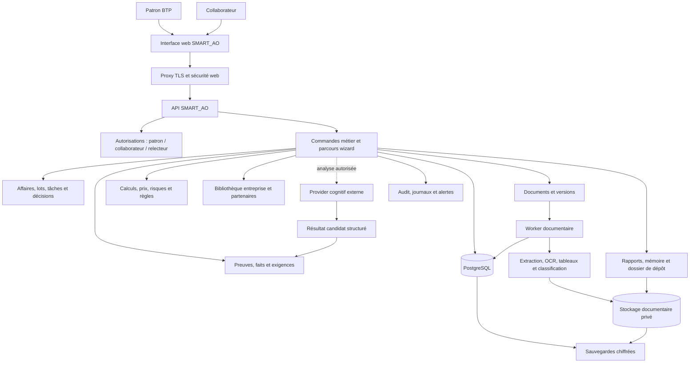

# SMART_AO V8 — Référence d’environnement, dépendances et infrastructure

**Version :** 2.0 — proposition à valider avant création du dépôt V8  
**Date :** 12 août 2026  
**Statut :** `SPECIFIED` — document de référence technique ; aucun code V8 n’est encore écrit.  
**Cible :** SaaS BTP mono-entreprise, déployé sur un VPS Ubuntu dédié de 32 Go RAM.  
**Objectif :** garantir un environnement fiable, sécurisé, maintenable et suffisamment puissant pour analyser des DCE, préparer des dossiers de réponse, protéger les données financières et accompagner le patron BTP dans ses décisions.

---

## 1. Objet du document

SMART_AO est un logiciel métier critique. Une donnée mal extraite, une clause ignorée, une pièce expirée, un prix dévoilé au mauvais utilisateur ou une sauvegarde inutilisable peuvent faire perdre un marché, une marge ou la confiance du client. L’infrastructure doit donc servir un objectif unique : **produire des résultats explicables, traçables, contrôlés et récupérables**.

Ce document fixe le standard technique complet de SMART_AO V8. Il couvre l’environnement de développement, le serveur client, les langages, les bibliothèques Python et TypeScript, les services Docker, les outils de calcul, les moteurs documentaires, le stockage, l’IA, les interfaces externes, la sécurité, les sauvegardes, l’observabilité et les règles d’exploitation.

> **Principe directeur :** les documents et les preuves restent au cœur du produit. Les algorithmes, l’IA, les solveurs et les services techniques les assistent ; ils ne les remplacent jamais comme source de vérité.

---

## 2. Architecture générale du produit

SMART_AO V8 est un **monolithe modulaire**. Cela signifie qu’il s’agit d’un seul produit cohérent, versionné dans un seul dépôt et déployé comme une seule solution, tout en séparant strictement les responsabilités métier. Cette organisation permet de préserver la fiabilité et la lisibilité nécessaires à un produit BTP, sans créer une plateforme impossible à maintenir sur un VPS client.



### 2.1. Les modules internes

| Module | Ce qu’il contient | Règle non négociable |
|---|---|---|
| **Affaires** | Consultation, lots, variantes, responsables, avancement wizard, décisions Go/No-Go et passage collaborateur → patron. | Une décision patron ne peut pas être remplacée par une sortie IA. |
| **Documents** | Téléversement, hash, versions, antivirus, classification, parsing, pages, tableaux et artefacts. | Un document prêt ne peut pas être modifié sans créer une nouvelle version. |
| **Preuves et exigences** | Extraits localisables, faits, obligations, pièces attendues, contradictions et statuts d’incertitude. | Aucune exigence ou conclusion importante sans source et emplacement relisible. |
| **Règles et calculs** | Délais, pénalités, prix, marges, trésorerie, révision, capacité, risques et optimisation. | Aucun LLM, aucun `float` financier et aucune règle non versionnée. |
| **Bibliothèque entreprise** | Kbis, assurances, attestations, qualifications, références, modèles, partenaires, fichiers de prix et historiques. | Les prix, coûts et marges sont réservés au patron. |
| **Dossier de réponse** | Mémoire technique, documents, DPGF/BPU/DQE, checklist, ZIP, versions et coffre de dépôt. | Le logiciel prépare et contrôle ; le patron valide ; l’utilisateur dépose. |
| **Notifications** | Échéances DCE, visites, pièces expirantes, corrections, demandes de validation et alertes chantier. | Toute notification est liée à une affaire, une obligation ou une pièce identifiable. |
| **Couche cognitive** | Analyse assistée, extraction structurée, comparaison, classification et rédaction de brouillons. | Une sortie est toujours un candidat à vérifier, jamais une vérité automatique. |

---

## 3. Standard matériel et système d’exploitation

### 3.1. Profil VPS recommandé par entreprise cliente

| Ressource | Standard requis | Recommandation | Rôle réel |
|---|---:|---:|---|
| **Système** | Ubuntu Server LTS 24.04 x86_64 | Version LTS maintenue et durcie | Base stable pour Docker, Python et mises à jour de sécurité. |
| **RAM** | 32 Go | 32 Go dédiés | Parsing, OCR, PostgreSQL, worker et marge de sécurité. |
| **CPU** | 4 vCPU minimum | **8 vCPU modernes** | L’OCR, l’extraction PDF, les tableaux et les exports dépendent fortement du CPU. |
| **Stockage** | 250 Go SSD/NVMe | **500 Go NVMe** | DCE, artefacts de parsing, exports, index, sauvegardes temporaires et croissance. |
| **Réseau** | IPv4, accès HTTPS | Pare-feu et accès SSH à clé | Services web et sauvegardes sortantes. |
| **GPU** | Non requis | Aucun dans le standard client | Le VPS est un nœud métier et documentaire, pas une ferme de modèles IA. |

La RAM de 32 Go permet un traitement documentaire robuste, mais ne rend pas réaliste l’hébergement permanent d’un gros modèle LLM local avec un parser et une base de données. Le CPU doit être considéré aussi attentivement que la RAM : un DCE scanné de plusieurs centaines de pages consommera surtout du temps CPU.

### 3.2. Préparation du serveur hôte

Le serveur est préparé une seule fois, de manière automatisée et reproductible. Le script de provisionnement doit installer uniquement les composants système nécessaires.

| Élément hôte | Standard V8 | Règle d’exploitation |
|---|---|---|
| Compte système | Utilisateur `smartao` non-root | Aucun service applicatif ne s’exécute sous `root`. |
| SSH | Clés uniquement, mot de passe désactivé | Les accès d’administration sont limités et journalisés. |
| Pare-feu | `ufw` ou équivalent | Seuls SSH, HTTP et HTTPS sont autorisés ; les services internes ne sont jamais exposés. |
| Docker Engine | Version stable maintenue | Images versionnées et mises à jour contrôlées. |
| Docker Compose | Plugin Compose v2 | Déploiement exclusivement par fichiers Compose versionnés. |
| `uv` | Gestionnaire Python | Environnements et dépendances Python reproductibles. |
| Node.js | LTS actuelle validée par le dépôt | Construction du frontend ; jamais de runtime Node ouvert sur Internet en production. |
| Git | Déploiement de release versionnée | Aucun DCE, secret ou export client dans Git. |
| Outils système | `curl`, `jq`, `ca-certificates`, `cron`/systemd timers, `restic` | Santé, sauvegardes, restauration et diagnostic. |
| OCR système | Tesseract + langue française, Ghostscript si requis | Utilisé en fallback local et contrôlé. |

---

## 4. Langages, outils de développement et règles de version

### 4.1. Langages de référence

| Domaine | Standard retenu | Utilisation |
|---|---|---|
| Backend et domaine métier | **Python 3.12.x** | API, modules métier, parsing, règles, calculs, workers et génération de documents. |
| Frontend | **TypeScript strict** | Wizard collaborateur, cockpit patron, bibliothèque et écrans de validation. |
| SQL | PostgreSQL SQL + migrations versionnées | Persistence, contraintes, index, recherche textuelle, audit et jobs. |
| Infrastructure | Docker Compose, Bash minimal, YAML | Déploiement, configuration, sauvegarde et exploitation. |
| Documentation technique | Markdown versionné | ADR, contrats, statut d’implémentation, procédures et handoffs. |

Python 3.12 est retenu comme base stable de V8. Il doit être verrouillé au niveau mineur dans le fichier `.python-version` et dans les images Docker. Les versions exactes des bibliothèques seront produites par `uv.lock`, non écrites à la main dans une liste figée qui vieillit.

### 4.2. Outils obligatoires du dépôt V8

| Outil | Rôle | Règle |
|---|---|---|
| `uv` | Résolution, installation et verrouillage des dépendances Python. | `pyproject.toml` et `uv.lock` sont versionnés. |
| `ruff` | Linting et formatage Python. | Exécuté en CI et avant chaque pull request. |
| `mypy` ou `pyright` | Vérification de types. | Obligatoire sur le noyau métier, les calculs et les contrats. |
| `pytest` | Tests unitaires, contrats, intégration et Golden DCE. | Aucun changement métier sans test adapté. |
| `hypothesis` | Tests génératifs sur arrondis, dates, seuils et calculs. | Utilisé pour les règles financières à risque. |
| `Alembic` | Migrations PostgreSQL. | Une migration est explicitement exécutée pendant la release, jamais cachée dans le démarrage de l’API. |
| `pre-commit` | Contrôles locaux rapides. | Évite secrets accidentels, erreurs de format et imports interdits. |
| `pnpm` | Gestion reproductible du frontend. | `pnpm-lock.yaml` est versionné. |
| `Vitest` et Playwright | Tests frontend, composants et parcours navigateur. | Les rôles patron/collaborateur et le wizard sont testés. |
| GitHub Actions | CI : qualité, tests, image, scans et artefacts. | La branche principale ne reçoit que des changements vérifiés. |

---

## 5. Dépendances Python du backend

Les dépendances sont séparées en groupes. Cette séparation évite qu’un worker OCR lourd soit installé ou démarré dans le processus web, et empêche les dépendances optionnelles de devenir obligatoires chez chaque client.

### 5.1. Groupe `core` : API, contrats et persistence

| Dépendance | Statut | Rôle dans V8 |
|---|---|---|
| `fastapi` | Obligatoire | API HTTP, validation d’entrée, dépendances d’autorisation et documentation interne. |
| `pydantic` + `pydantic-settings` | Obligatoire | Contrats d’entrée/sortie, configuration validée au démarrage et types de domaine aux frontières. |
| `uvicorn` | Obligatoire | Serveur ASGI derrière le proxy TLS. |
| `gunicorn` | Production | Gestion des processus API en production. |
| `httpx` | Obligatoire | Appels HTTP sortants contrôlés : BOAMP, OCR premium, provider cognitif, e-mail ou APIs publiques. |
| `python-multipart` | Obligatoire | Téléversement de DCE et pièces entreprise. |
| `websockets` | Obligatoire | Progression de parsing et événements visuels du wizard. |
| `sqlalchemy` | Obligatoire | Persistence et accès base de données dans l’infrastructure, jamais dans le domaine pur. |
| `asyncpg` | Obligatoire | Driver PostgreSQL asynchrone de production. |
| `alembic` | Obligatoire | Migrations versionnées. |
| `structlog` | Obligatoire | Journaux structurés avec corrélation, sans contenu métier sensible. |
| `tenacity` | Obligatoire | Retentatives limitées et contrôlées des appels externes. |
| `orjson` | Option contrôlée | Sérialisation performante si elle reste compatible avec les contrats. |

### 5.2. Groupe `document` : DCE, PDF, Office et rendu

| Dépendance | Statut | Rôle précis |
|---|---|---|
| `pymupdf` | Obligatoire | Lecture de texte et métadonnées PDF, rendu de pages, repérage de zones et annotations si nécessaire. |
| `pdfplumber` | Obligatoire | Contrôle complémentaire des tableaux, lignes et positions dans les PDF. |
| `pypdfium2` | Option de fallback | Rendu robuste de pages lorsque PyMuPDF ne suffit pas. |
| `docling` | Obligatoire dans l’image worker | Extraction structurée de documents : mise en page, tableaux, blocs et OCR configurable. |
| `pikepdf` | Recommandé | Validation et manipulation sûre des PDF, sans reconstruire silencieusement le contenu. |
| `openpyxl` | Obligatoire | Lecture, préremplissage et génération de DPGF, BPU, DQE, fichiers de prix et documents Excel. |
| `python-docx` | Obligatoire | Génération de documents Word fondés sur des modèles validés. |
| `jinja2` | Obligatoire | Modèles de mémoire, courriers, notes et rapports, alimentés par des données validées. |
| `weasyprint` | Obligatoire | Génération PDF depuis des modèles HTML/CSS maîtrisés. |
| `matplotlib` | Recommandé | Gantt, graphiques de trésorerie, courbes d’avancement et exports PNG/SVG. |
| `python-magic` | Obligatoire | Vérification du type réel d’un fichier avant traitement. |
| `clamd` | Obligatoire | Communication avec le scanner antivirus ClamAV. |

Docling peut fonctionner avec une installation CPU et plusieurs moteurs OCR. Les capacités OCR/VLM nécessitant CUDA ne font pas partie du profil VPS client standard. [1]

### 5.3. Groupe `math` : calcul déterministe, finance et optimisation

Ce groupe est l’un des actifs majeurs de SMART_AO. Il ne contient aucun appel LLM et ne manipule pas de dictionnaire libre. Toute formule doit être versionnée, documentée et testée.

| Dépendance | Statut | Usage autorisé dans SMART_AO |
|---|---|---|
| `decimal` (bibliothèque standard) | Obligatoire | Tous les euros, taux, arrondis, pénalités, marges, coefficients et résultats financiers. |
| `ortools` | Obligatoire | Optimisation discrète : affectation de ressources, choix de scénarios, organisation de tâches, contraintes de planning et variantes combinatoires. OR-Tools est une bibliothèque d’optimisation proposée en Python et maintenue par Google. [2] |
| `highspy` | Obligatoire | Programmation linéaire, mixte et quadratique : contraintes de capacité, scénarios de trésorerie, optimisation de ressources ou sous-traitance. HiGHS couvre LP, MIP et QP. [3] |
| `pulp` | Compatibilité contrôlée | Façade de modélisation pour règles existantes ou cas simples ; les nouveaux solveurs critiques choisissent explicitement OR-Tools ou HiGHS. |
| `numpy` | Recommandé | Calculs vectoriels et statistiques non monétaires. Aucun montant final ne reste en `float`. |
| `pandas` | Recommandé | Import, nettoyage et comparaison de fichiers Excel internes ; pas de calcul financier final sans conversion `Decimal`. |
| `scipy` | Option mesurée | Analyse numérique, interpolation ou optimisation spécialisée non couverte par OR-Tools/HiGHS. |
| `python-dateutil` | Obligatoire | Durées, calendriers, échéances et règles de dates. |

### 5.4. Règle de choix entre OR-Tools, HiGHS et PuLP

Les trois outils ne sont pas des doublons. Ils sont utilisés selon la nature du problème, et le solveur choisi est enregistré dans la trace du calcul.

| Situation BTP | Outil privilégié | Exemple |
|---|---|---|
| Choisir une combinaison finie de lots, équipes, variantes ou ressources sous contraintes. | **OR-Tools CP-SAT** | Répartir les moyens humains sur plusieurs affaires sans dépasser les capacités. |
| Optimiser un coût, une capacité, un plan de financement ou une allocation avec variables continues/linéaires. | **HiGHS** | Calculer un scénario de trésorerie ou une allocation de capacité sous contraintes financières. |
| Reprendre une formulation linéaire existante ou prototyper un modèle lisible. | **PuLP** | Construire une matrice de test avant validation d’un modèle de production. |
| Calcul direct de marge, pénalité, indexation, pourcentage ou arrondi. | **Python + Decimal** | Pénalité 200 €/jour plafonnée à 20 % HT. Aucun solveur nécessaire. |

OR-Tools est installable directement via `pip` et propose notamment ses capacités de programmation par contraintes. HiGHS est un solveur open source sous licence MIT pour LP, MIP et QP. PuLP peut intégrer HiGHS et OR-Tools CP-SAT ; il doit donc être traité comme une couche de modélisation, pas comme une source de vérité métier. [2] [3] [4]

### 5.5. Groupe `security` : identité, autorisation, audit et durcissement

| Dépendance | Statut | Rôle |
|---|---|---|
| `argon2-cffi` | Obligatoire | Hachage des mots de passe locaux. |
| `PyJWT` | Obligatoire | Jetons de session courts et signés. |
| `cryptography` | Obligatoire | Chiffrement applicatif, signatures, clés et enveloppes de secrets. |
| `slowapi` ou limiteur équivalent | Obligatoire | Protection contre les tentatives abusives et l’énumération de comptes. |
| `email-validator` | Obligatoire | Validation stricte des identifiants e-mail. |
| `pyotp` | Option recommandée | Deuxième facteur d’authentification patron lorsque le produit est ouvert au client. |
| `boto3` | Obligatoire | Accès compatible S3 au stockage objet et aux sauvegardes externes. |
| `sigstore` / `minisign` | Différé | Vérification de signatures de release pour une flotte de plusieurs VPS. |

Le standard V8 n’installe pas trois systèmes d’autorisations concurrents. Les permissions sont contrôlées par l’application avec un `ActorContext` obligatoire : identité, tenant, rôle, affaire, classification de données et finalité de lecture ou d’écriture.

### 5.6. Groupe `jobs`, `notifications` et intégrations

| Dépendance | Statut | Rôle |
|---|---|---|
| Jobs PostgreSQL + worker Python | Obligatoire | Parsing, génération, indexation, e-mails et tâches longues, avec idempotence. |
| `apscheduler` | Option contrôlée | Rappels planifiés : échéances, certificats, sauvegardes, vérifications. |
| `aiosmtplib` | Obligatoire | Envoi SMTP transactionnel si l’entreprise active l’e-mail. |
| `icalendar` | Recommandé | Exports ICS de visites, dates limites et jalons. |
| Redis | Différé | Ajouté seulement lorsqu’un besoin de cache, limite de débit distribuée ou file externe est démontré. |
| Celery | Différé | Non retenu dans le noyau initial ; les jobs PostgreSQL sont plus simples et auditables pour un VPS mono-client. |
| n8n | Intégration future | Automatisations explicitement validées ; n’est pas une dépendance du cœur V8. |

### 5.7. Groupe `quality` : tests et sécurité de la chaîne de livraison

| Dépendance / outil | Usage |
|---|---|
| `pytest`, `pytest-asyncio` | Tests de domaine, API, workers et persistence. |
| `hypothesis` | Cas limites sur formules, seuils, dates et arrondis. |
| `testcontainers` | Tests d’intégration réels avec PostgreSQL, MinIO et ClamAV en CI. |
| `coverage` | Suivi de couverture utile, jamais utilisé comme preuve métier unique. |
| `bandit` et `pip-audit` | Analyse de sécurité Python et dépendances vulnérables. |
| `trivy` | Scan des images Docker et dépendances système. |
| `detect-secrets` | Prévention des secrets dans Git. |
| `playwright` | Tests E2E du wizard, des rôles et des verrouillages financiers. |

---

## 6. Dépendances frontend

Le frontend est une application web. Il doit rester volontairement sobre : un écran utile à la fois pour le collaborateur, une vision globale et confidentielle pour le patron.

| Dépendance | Statut | Rôle |
|---|---|---|
| React + TypeScript | Obligatoire | Interface métier et composants réutilisables. |
| Vite | Obligatoire | Construction rapide et déterministe du frontend. |
| Tailwind CSS | Recommandé | Système visuel cohérent et maintenable. |
| React Router | Obligatoire | Navigation entre cockpit, affaires, bibliothèque et wizard. |
| TanStack Query | Obligatoire | Cache et synchronisation contrôlée avec l’API. |
| React Hook Form + Zod | Obligatoire | Formulaires wizard validés côté utilisateur avant envoi API. |
| Zustand | Option mesurée | État local d’interface ; l’état métier reste toujours côté serveur. |
| Recharts ou ECharts | Recommandé | Graphiques de délais, risques, trésorerie et avancement. |
| `react-pdf` ou viewer dédié | Recommandé | Consultation d’une preuve ou d’une page de DCE dans l’interface. |
| Playwright | Obligatoire | Tests du parcours collaborateur et des protections patron. |

Aucune donnée financière ne doit être envoyée au navigateur d’un collaborateur, même masquée visuellement. Le filtre s’applique côté serveur avant sérialisation de la réponse API.

---

## 7. Services Docker du VPS client

### 7.1. Services obligatoires

| Service | Image / runtime | Rôle | Ports publics |
|---|---|---|---|
| **Caddy** | Image Caddy stable | TLS, reverse proxy, en-têtes de sécurité, compression et diffusion du frontend. | `80`, `443` uniquement. |
| **Frontend** | Fichiers statiques construits | Wizard, cockpit patron, écrans affaires et bibliothèque. | Via Caddy seulement. |
| **API** | Image Python V8 | Commandes métier, authentification, autorisations, lectures et exports. | Aucun port public direct. |
| **Worker** | Même image Python, commande dédiée | Parsing, OCR, génération, notifications et jobs idempotents. | Aucun. |
| **PostgreSQL + pgvector** | PostgreSQL maintenu | État canonique, audit, recherches textuelles, jobs, migrations et index vectoriel initial. | Aucun. |
| **MinIO** | Stockage objet compatible S3 | DCE originaux, versions, artefacts extraits, exports, rapports et ZIP. | Aucun. |
| **ClamAV** | Scanner antivirus | Contrôle des fichiers entrants et quarantaine. | Aucun. |

### 7.2. Services optionnels, activés uniquement après preuve de besoin

| Service | Condition d’activation | Usage |
|---|---|---|
| **Qdrant** | Benchmark démontrant un gain net de retrieval sur DCE Golden. | Recherche vectorielle dédiée et index volumineux. |
| **Redis** | Besoin démontré de cache distribué ou de limite de débit partagée. | Cache technique ; jamais source de vérité. |
| **Prometheus + Grafana** | Passage en préproduction ou besoin de diagnostic avancé. | Métriques, tableaux de santé et alertes. |
| **Loki / Tempo / OpenTelemetry collector** | Multiplication des VPS ou diagnostic distribué. | Logs et traces centralisables sans contenu métier. |
| **n8n** | Workflow externe validé par le patron et sécurité des connecteurs définie. | Automatisations non critiques : alertes, synchronisations et relances. |
| **Qdrant / embeddings locaux** | Corpus suffisamment grand et tests qualité concluants. | Extension de la recherche documentaire. |
| **Serveur GPU / LLM local** | GPU réel, budget, maintenance, benchmark et politique de confidentialité validés. | Profil spécialisé, jamais installé par défaut chez le client. |

### 7.3. Réseaux et volumes

| Élément | Règle V8 |
|---|---|
| Réseau public | Caddy uniquement. Aucun port PostgreSQL, MinIO, Qdrant, Redis, Grafana ou API n’est publié sur Internet. |
| Réseau interne | Tous les services communiquent sur un réseau Docker privé nommé `smartao-internal`. |
| Volumes persistants | `postgres`, `object-store`, `clamav`, `caddy-certificates`, `backups-staging`. |
| Volumes interdits en production | Montage du code source local, `.env` exposé dans l’image, dossier utilisateur public ou cache de modèles non plafonné. |
| Images | Tag de version ou digest immuable ; jamais `latest` en production. |
| Healthchecks | PostgreSQL, API, worker, MinIO et ClamAV doivent disposer d’un contrôle de santé. |

---

## 8. PostgreSQL, stockage documentaire et recherche

### 8.1. PostgreSQL : source de vérité

PostgreSQL conserve tout ce qui doit pouvoir être recherché, audité, restauré et rejoué : utilisateurs, rôles, entreprises, affaires, lots, décisions, documents, versions, artefacts, preuves, exigences, règles, calculs, tâches, rapports, notifications, jobs et audit.

| Donnée | Stockage principal | Règle |
|---|---|---|
| Identités, rôles, permissions | PostgreSQL | Donnée transactionnelle versionnée. |
| Affaires, lots, étapes wizard | PostgreSQL | Transitions d’état explicites. |
| Exigences, risques, actions, décisions | PostgreSQL | Toute entrée importante référence une source ou une saisie identifiée. |
| Prix, marges, trésorerie et scénarios | PostgreSQL | Chiffrement applicatif si requis, accès patron exclusivement. |
| Calculs | PostgreSQL | Inputs, règles, arrondis, moteur, résultat et trace. |
| Jobs | PostgreSQL | Verrouillage, idempotency key, tentatives et état. |
| Audit | PostgreSQL + export immuable si nécessaire | Journal append-only ; pas de données brutes inutiles. |

L’extension `pgvector` est installée dans PostgreSQL pour les besoins initiaux de recherche sémantique. Elle évite d’ajouter une seconde base tant que le volume et les tests ne le justifient pas.

### 8.2. Stockage objet privé

MinIO ou un stockage S3 compatible est utilisé pour les fichiers qui ne doivent pas être stockés comme colonnes de base de données.

| Bucket logique | Contenu | Accès |
|---|---|---|
| `originals` | Fichiers DCE et pièces téléversées, immuables et hashés. | Selon affaire et rôle. |
| `derived` | Texte extrait, JSON de parsing, rendus de pages, tableaux et OCR. | Interne ; consultation patron/collaborateur selon la pièce. |
| `exports` | Rapports PDF, DOCX, XLSX, ZIP de dépôt et dossiers générés. | Liens temporaires autorisés uniquement. |
| `quarantine` | Fichiers suspects, type invalide ou scan en échec. | Administrateur technique uniquement. |
| `backups` | Snapshots temporaires avant transfert chiffré hors VPS. | Service de backup uniquement. |

Chaque objet porte : tenant, affaire, type de document, version, hash, classification, date de création, créateur et durée de conservation. Aucun bucket n’est public.

### 8.3. Recherche documentaire

| Niveau | Mécanisme | Usage |
|---|---|---|
| Recherche exacte | PostgreSQL full-text + filtres de métadonnées | Retrouver un article, une date, un mot-clé, une pièce ou une page. |
| Recherche structurée | Tables de faits, exigences, pièces et sections | Répondre à « quelles pièces manquent ? », « quelles échéances ? » ou « quelles pénalités ? ». |
| Recherche sémantique | `pgvector` avec filtre tenant/affaire/document/version | Retrouver une formulation proche sans sortir du dossier autorisé. |
| Recherche avancée | Qdrant, si validé | Volumes plus grands, index spécialisés ou latence démontrée. |

La recherche ne produit jamais une conclusion sans retour à l’extrait d’origine. Qdrant, s’il est activé, doit être placé sur SSD/NVMe, filtré par tenant et sauvegardé ; son dimensionnement dépend du nombre de vecteurs, de leurs dimensions, de leurs payloads et des index activés. [5]

---

## 9. Chaîne documentaire et OCR

### 9.1. Admission d’un fichier

Avant toute analyse, un fichier passe dans les contrôles suivants :

1. limite de taille et quota par entreprise ;
2. type réel du fichier et extension cohérente ;
3. hash SHA-256 ;
4. antivirus ClamAV ;
5. détection de doublon ;
6. isolation dans le stockage privé ;
7. création d’une version immuable ;
8. planification d’un job de parsing.

Un fichier non conforme est mis en quarantaine. Il ne doit jamais être analysé ou rendu accessible par erreur.

### 9.2. Chaîne d’extraction

| Étape | Outil principal | Résultat |
|---|---|---|
| PDF textuel | PyMuPDF | Texte paginé, métadonnées, liens, dimensions et premier diagnostic. |
| Tableaux et positions | pdfplumber | Lignes, colonnes, tableaux, coordonnées et contrôles. |
| Mise en page complexe | Docling | Blocs, titres, tableaux, ordre de lecture et OCR configurable. |
| Fallback de rendu | pypdfium2 | Images de pages pour OCR ou comparaison. |
| Scan dégradé | Tesseract français ou profil Docling OCR | Texte candidat avec score de qualité. |
| Exception lourde | MinerU, activé manuellement et séquentiellement | Analyse renforcée d’un dossier difficile. |
| Exception cloud | OCR premium explicitement autorisé | Résultat candidat, uniquement sur pages nécessaires, avec trace et coût. |

MinerU est capable de fonctionner sur CPU, mais sa documentation indique 16 Go de RAM minimum et 32 Go recommandés en mode pipeline CPU. Il est donc réservé à un mode exceptionnel, séquentiel et plafonné sur le VPS client. [6]

### 9.3. Contrôle de qualité documentaire

Chaque page reçoit des indicateurs : présence de texte, ratio OCR, densité, qualité de lecture, présence de tableau, présence de signature, langue présumée et risque de perte de mise en page. Une règle métier peut demander une nouvelle lecture ou une revue humaine si un résultat critique dépend d’une page à faible confiance.

---

## 10. Intelligence artificielle et dépendances externes

### 10.1. Règle fondamentale

SMART_AO ne dépend pas d’un modèle IA local pour fonctionner. Les fonctionnalités essentielles — ingestion, preuves, règles, calculs, génération de documents, wizard, contrôle d’accès et stockage — sont exécutées sur le VPS client.

Un provider cognitif externe peut être appelé pour améliorer l’analyse de documents difficiles, l’extraction structurée, la comparaison de pièces ou la rédaction d’un brouillon. Il est toujours utilisé par un adaptateur configurable ; aucun nom de modèle ou fournisseur ne doit être figé dans le domaine métier.

| Classe de service externe | Usage possible | Conditions obligatoires |
|---|---|---|
| Provider cognitif multimodal | Analyse de tableau complexe, page scannée, contradiction, plan ou cadrage de mémoire. | Autorisation client, classification de données, minimisation des pages envoyées, budget, journal et fallback humain. |
| OCR cloud premium | Pages dont le parsing local est insuffisant. | Même politique ; jamais activation silencieuse. |
| BOAMP / données publiques | Veille, import d’avis et alimentation du radar d’opportunités. | Source identifiable, traitement idempotent, date de collecte et respect des limites d’usage. |
| URSSAF / vérification documentaire | Assistance à la vérification d’une attestation lorsque les informations requises sont présentes. | Aucun blocage de paiement ou décision juridique automatique. |
| INSEE et référentiels publics | Indices de révision, données de contexte et références. | Version, source, date d’effet et vérification du champ d’application. |
| SMTP / e-mail | Alertes, demandes de pièces et rappels. | Consentement, modèle approuvé, journal d’envoi et aucune action engageante sans validation. |
| Stockage de backup | Copie chiffrée hors VPS. | Pays, contrat, clé, rétention et restauration testée. |
| n8n | Automatisations périphériques. | Flux explicitement défini, secrets isolés, logs et possibilité de désactivation. |

### 10.2. Politique de données vers une IA externe

| Classe de donnée | Envoi externe par défaut | Décision |
|---|---|---|
| DCE public | Désactivé par défaut ; activable par le patron. | Envoi limité aux pages ou extraits nécessaires. |
| Prix internes, marges, déboursés, trésorerie | Interdit. | Ne sort jamais du VPS sans décision exceptionnelle explicite du patron. |
| Données personnelles, pièces administratives et partenaires | Interdit par défaut. | Politique spécifique et consentement nécessaires. |
| Document confidentiel ou marqué sensible | Interdit. | Revue locale ou humaine uniquement. |
| Résultat d’appel IA | Jamais accepté automatiquement. | Devient un candidat avec sources et niveau de confiance. |

### 10.3. Modèles locaux et GPU

Un serveur local de modèles peut être ajouté plus tard sur une infrastructure GPU séparée si un benchmark démontre une valeur supérieure et un coût d’exploitation acceptable. Ce n’est pas une dépendance standard du VPS client.

vLLM supporte l’inférence CPU x86, mais recommande notamment AVX-512 et précise des limites de plateforme ; son existence ne justifie pas d’utiliser un VPS 32 Go comme serveur LLM puissant. [7]

---

## 11. Sécurité, confidentialité et audit

### 11.1. Identité et permissions

| Rôle | Capacités | Interdits |
|---|---|---|
| **Patron administrateur** | Crée les comptes, gère l’entreprise, les prix, les documents sensibles, les paramètres IA, les décisions et le dépôt. | Accès aux données d’une autre entreprise. |
| **Collaborateur** | Prépare les DCE et pièces qui lui sont attribués, renseigne le wizard, propose des actions et demande validation. | Prix, marges, trésorerie, règles de chiffrage et affaires non attribuées. |
| **Partenaire externe** | Répond à une demande limitée de prix ou de document. | Bibliothèque complète, fichiers internes, autres affaires et données patron. |
| **Support technique** | Intervient selon procédure et droit strictement nécessaire. | Lecture libre des DCE, prix ou documents client. |

### 11.2. Mesures obligatoires

| Domaine | Mesure V8 |
|---|---|
| Authentification | Argon2, session courte, rotation, limitation de tentatives et deuxième facteur patron recommandé. |
| Transport | HTTPS obligatoire, certificats gérés par Caddy et redirections sécurisées. |
| Réseau | Seul Caddy est public. Base, stockage, workers, scanner et observabilité sont privés. |
| Fichiers | Scan ClamAV, type réel vérifié, hash, chemin privé, liens temporaires et contrôle d’accès à chaque téléchargement. |
| Isolation | Toute requête porte tenant, rôle, affaire et classification ; aucune recherche sans filtre tenant. |
| Secrets | Stockage hors Git, permissions strictes, rotation, aucun secret par défaut. |
| Audit | Actions sensibles append-only : connexions, téléchargements, changements de prix, validations, exports, appels externes et dépôts. |
| Journalisation | Corrélation et diagnostic sans insérer par défaut le contenu brut des DCE, les prix ou les tokens. |
| Sauvegarde | Données et objets chiffrés, exportés hors VPS, restauration testée. |

---

## 12. Notifications, calendrier et temps réel

SMART_AO utilise le temps réel uniquement lorsqu’il améliore réellement l’expérience utilisateur : progression d’un parsing, avancement wizard, nouvelle tâche, demande de validation patron ou échéance imminente.

| Mécanisme | Usage |
|---|---|
| WebSocket ou SSE | Progression de parsing, état de job et mises à jour de l’affaire ouverte. |
| Jobs planifiés | Rappels J-30/J-15/J-7/J-2/J-1/H-4, dates de visite, pièces expirantes et backups. |
| E-mail SMTP | Alertes choisies par le patron, invitations collaborateurs, demandes partenaires et notifications de dépôt. |
| ICS | Ajout d’une visite ou d’une date limite à un calendrier professionnel. |
| Tableau de bord | Affaires en retard, blocages, risque documentaire, besoin de validation et santé des pièces administratives. |

Les notifications critiques doivent être idempotentes. Une même échéance ne doit pas générer plusieurs alertes identiques après un redémarrage ou une relance de worker.

---

## 13. Sauvegarde, restauration et continuité

### 13.1. Politique minimale de sauvegarde

| Élément | Fréquence | Destination | Test |
|---|---|---|---|
| PostgreSQL | Quotidienne + avant migration | Chiffrée hors VPS | Restauration sur préproduction au minimum mensuelle. |
| Stockage objet | Quotidienne incrémentale | Chiffrée hors VPS | Vérification hash et restauration d’un échantillon. |
| Configuration | À chaque release | Dépôt privé + coffre de secrets | Reconstruction d’un nœud vierge. |
| Images Docker | À chaque release validée | Registre privé | Re-déploiement reproductible. |
| Référentiels métier | À chaque version de règle | Git + métadonnées en base | Comparaison de version et tests de régression. |

### 13.2. Procédure de restauration

Une procédure de restauration doit répondre aux questions suivantes : quel backup est utilisé, quel est son hash, quelle version d’image est restaurée, quelle migration doit être appliquée ou évitée, comment vérifier les documents, comment valider les droits et comment remettre le service en ligne sans perdre de jobs.

Le passage en production client est interdit tant qu’une restauration complète — base, documents, artefacts, permissions et rapport — n’a pas été exécutée sur l’environnement de préproduction.

---

## 14. Observabilité, santé et exploitation

### 14.1. Santé minimale obligatoire

| Contrôle | Ce qui est mesuré |
|---|---|
| API | Disponibilité, latence, erreurs 4xx/5xx et saturation. |
| PostgreSQL | Connexion, espace, taille, migrations, locks et sauvegarde récente. |
| Worker | Jobs en attente, jobs en erreur, durée de parsing et nombre de tentatives. |
| Stockage objet | Disponibilité, espace, erreurs d’écriture et vérification des objets. |
| ClamAV | Date des signatures, service actif et erreurs de scan. |
| Hôte | CPU, RAM, disque, swap, charge et certificat TLS. |
| Backup | Date, résultat, volume et dernière restauration testée. |

### 14.2. Paliers d’observabilité

| Palier | Composants | Quand l’activer |
|---|---|---|
| **Standard client** | Healthchecks Docker, logs JSON, métriques `/metrics` protégées et alertes simples. | Dès le premier environnement de préproduction. |
| **Support avancé** | Prometheus + Grafana local. | Première mise à disposition client ou besoin de diagnostic récurrent. |
| **Flotte** | OpenTelemetry, agrégation contrôlée de santé technique, gestion de versions. | Plusieurs VPS clients ; aucune donnée métier transférée. |

---

## 15. Structure cible du dépôt V8

```text
smart-ao-v8/
├── README.md
├── pyproject.toml
├── uv.lock
├── .python-version
├── .env.example
├── compose.yaml
├── compose.preprod.yaml
├── Caddyfile
├── Makefile
├── docs/
│   ├── V8_PRODUCT_CONTRACT.md
│   ├── V8_DOMAIN_MODEL.md
│   ├── V8_GOLDEN_DCE_CATALOG.md
│   ├── V8_IMPLEMENTATION_STATUS.md
│   ├── V8_MASTER_REBUILD_PLAN.md
│   ├── ADR/
│   └── runbooks/
├── backend/
│   ├── src/smartao/
│   │   ├── api/
│   │   ├── application/
│   │   ├── domain/
│   │   │   ├── affaires/
│   │   │   ├── documents/
│   │   │   ├── evidence/
│   │   │   ├── rules/
│   │   │   ├── math/
│   │   │   ├── reporting/
│   │   │   └── identity/
│   │   ├── infrastructure/
│   │   │   ├── postgres/
│   │   │   ├── object_store/
│   │   │   ├── document_parsing/
│   │   │   ├── cognitive/
│   │   │   ├── notifications/
│   │   │   └── security/
│   │   └── workers/
│   ├── alembic/
│   └── tests/
├── frontend/
│   ├── src/
│   │   ├── screens/
│   │   ├── features/
│   │   ├── components/
│   │   └── api/
│   └── package.json
├── deploy/
│   ├── Dockerfile.api
│   ├── Dockerfile.worker
│   ├── scripts/
│   │   ├── bootstrap-host.sh
│   │   ├── deploy-release.sh
│   │   ├── backup.sh
│   │   ├── restore.sh
│   │   ├── healthcheck.sh
│   │   └── smoke-test.sh
│   └── systemd/
└── fixtures/
    └── golden-dce-anonymized/
```

Cette arborescence remplace la logique des « engines » génériques par des modules explicitement liés au métier. Elle préserve néanmoins tous les domaines utiles : documents, connaissance, calcul, sécurité, notifications, travailleurs de fond et exploitation.

---

## 16. Politique de dépendances et mises à jour

| Règle | Application |
|---|---|
| Versions Python | Pin au niveau mineur, mise à jour planifiée et validée en préproduction. |
| Packages Python | Déclarés dans `pyproject.toml`, verrouillés dans `uv.lock`. |
| Packages frontend | Déclarés et verrouillés avec `pnpm-lock.yaml`. |
| Images Docker | Tag de version ou digest, jamais `latest`. |
| Mises à jour | Dépendabot/Renovate ou revue mensuelle, jamais mise à jour automatique silencieuse en production. |
| Vulnérabilités | Scan CI et patch classé par criticité. |
| Migration | Migration testée sur copie de base et rollback documenté. |
| Référentiels métier | Toute mise à jour porte source, propriétaire, date d’effet, version et tests. |
| LLM / OCR externe | Version/provider configuré, policy de données, budget, trace et fallback. |

---

## 17. Ordre de construction technique

| Étape | Contenu | Résultat contrôlable |
|---:|---|---|
| 1 | Dépôt, toolchain Python/TypeScript, Docker, CI et documentation source de vérité. | Démarrage reproductible sur poste et préproduction. |
| 2 | PostgreSQL, MinIO, Caddy, identité patron/collaborateur et secrets. | Création de comptes et interdiction vérifiée des données financières au collaborateur. |
| 3 | Admission de fichier, antivirus, hash, version et stockage privé. | DCE téléversé sans fuite, avec version et statut visibles. |
| 4 | Extraction paginée, tables, OCR et preuves localisables. | DCE-GOLD-001 navigable vers les sources. |
| 5 | Exigences, pièces, délais, pénalités, contradictions et tâches. | Fiche de risques contrôlée et sourcée. |
| 6 | Noyau Math : `Decimal`, OR-Tools, HiGHS et règles versionnées. | Calculs reproductibles avec tests de bord. |
| 7 | Wizard collaborateur, cockpit patron, bibliothèque et transfert de validation. | Parcours complet sans fuite financière. |
| 8 | Dossier de réponse, génération DOCX/PDF/XLSX, ZIP et coffre de dépôt. | Dossier test complet, versionné et contrôlé. |
| 9 | IA externe contrôlée, retrieval avancé et automatisations optionnelles. | Gain mesuré sur Golden DCE face à la baseline locale. |
| 10 | Préproduction, backup/restore, monitoring, release et premier client. | Gates de fiabilité, incident et rollback testés. |

---

## 18. Définition de « prêt à héberger un client »

SMART_AO ne sera prêt à vivre sur le VPS d’un client que lorsque les points suivants seront prouvés, et non simplement déclarés :

1. le serveur peut être reconstruit automatiquement depuis une version connue ;
2. les secrets ne sont ni dans Git ni dans les images ;
3. le patron et le collaborateur voient exactement les données prévues par leur rôle ;
4. les documents sont hashés, analysés, conservés et retrouvables ;
5. les calculs financiers utilisent uniquement les règles et arrondis validés ;
6. les résultats DCE critiques renvoient à leurs sources ;
7. les appels externes sont désactivables, contrôlés et journalisés ;
8. la sauvegarde et la restauration ont été exécutées avec succès ;
9. une release, un rollback et une procédure d’incident ont été testés ;
10. le DCE Golden produit les résultats métier attendus ;
11. le fondateur valide explicitement la mise à disposition.

---

## Références

[1] [Docling — Installation et moteurs OCR](https://docling-project.github.io/docling/getting_started/installation/)  
[2] [Google OR-Tools — Installation et optimisation](https://developers.google.com/optimization/install)  
[3] [HiGHS — Optimisation LP, MIP et QP](https://highs.dev/)  
[4] [PuLP — Configuration des solveurs, HiGHS et OR-Tools CP-SAT](https://coin-or.github.io/pulp/guides/how_to_configure_solvers.html)  
[5] [Qdrant — Exigences d’installation](https://qdrant.tech/documentation/installation/)  
[6] [MinerU — Environnements CPU/GPU et prérequis](https://opendatalab.github.io/MinerU/quick_start/)  
[7] [vLLM — Installation CPU](https://docs.vllm.ai/en/stable/getting_started/installation/)  
[8] `Arborescence_V7.txt` — inventaire technique V7.1 fourni par le fondateur.  
[9] `CHARTE_RECONSTRUCTION_SMART_AO_V8.md` — règles de preuve, sécurité et reconstruction V8.
